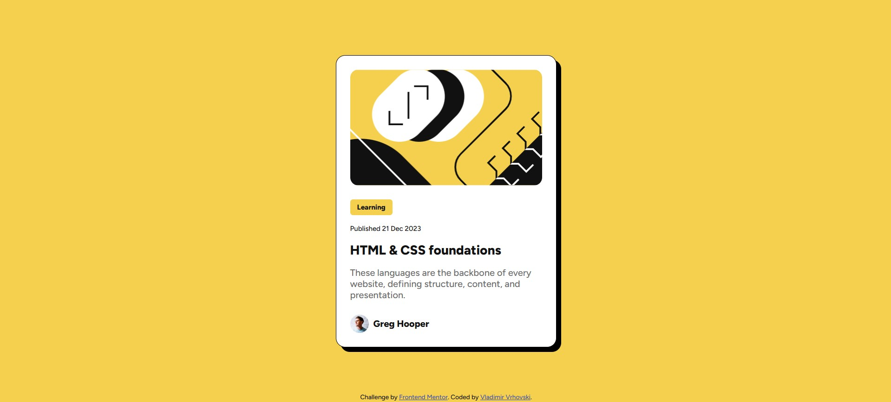

# Frontend Mentor - Blog preview card solution

This is a solution to the [Blog preview card challenge on Frontend Mentor](https://www.frontendmentor.io/challenges/blog-preview-card-ckPaj01IcS).

## Table of contents

- [Overview](#overview)
  - [The challenge](#the-challenge)
  - [Screenshot](#screenshot)
  - [Links](#links)
- [My process](#my-process)
  - [Built with](#built-with)
- [Author](#author)
- [Acknowledgments](#acknowledgments)

**Note: Delete this note and update the table of contents based on what sections you keep.**

## Overview

### The challenge

Users should be able to:

- See hover and focus states for all interactive elements on the page

### Screenshot

### Links

- Solution URL: [GitHub](https://github.com/VladimirVrhovski/blog-preview-card-main)
- Live Site URL: [Live site](https://vladimirvrhovski.github.io/blog-preview-card-main/)

## My process

As always I added all the needed html components using emmet and did a simple css reset and general styling. Then I started by positioning the card in the center and gave it the display property of flex. Secondly I styled the card component so it resembles the design as close as possible and after that I added the Card picture using a div and background-image with background-size: cover; and background-postion: center;. After that I started styling all the card text with different font sizes and weights, also adding a background to the category component and a media query for the changing font size of the card description. Lastly I just touched up the profile photo and name components:

### Built with

- Semantic HTML5 markup
- CSS custom properties
- Flexbox
- CSS Grid
- Mobile-first workflow

## Author

- Frontend Mentor - [@VladimirVrhovski](https://www.frontendmentor.io/profile/VladimirVrhovski)
- Instagram - [@dovla7\_](https://www.instagram.com/dovla7_)
- UpWork - [Vladimir Vrhovski](https://www.upwork.com/freelancers/~012c647015861fb26b?mp_source=share)
